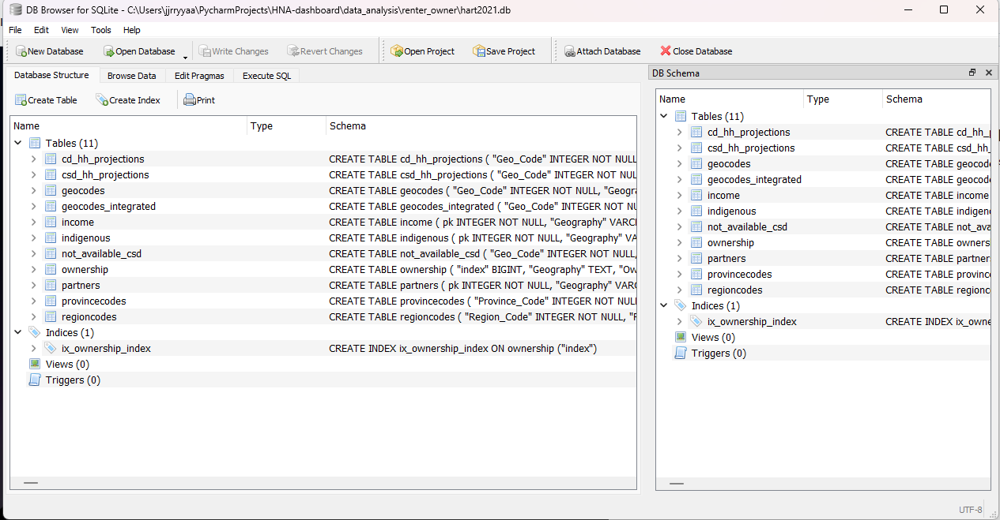

# How to use
These scripts were written after the original database generation by 
Licker Geospatial.  The original database is a SQLite file, which contains
several different tables generated from the Canadian census data.  These tables
do not contain a primary key (even though they really look like they would).  
I would not have approved of this, but I didn't start this so yeah.

You can use a rudimentary explorer such as [this tool](https://sqlitebrowser.org/)
to explore existing tables

Example as below

However since I (Jack) inherited this project several months after the completion,
I never had access to the original scripts to create this database.  (Retcon, I just got access a month before I left, 
refer to [this for the files](https://github.com/UBC-HART/HNA-DataGen))  As such, I created several 
scripts to append new requests to this database. I plan to format it better 
someday, but since they are one time use and as of right now, and literally only I 
use them, I haven't gotten to it.  

Currently, these scripts must be run on the database, while pointing to the correct
`.csv` files, and `.db` file.  If the script throws an error, the script is probably
just looking at the wrong places for said files.  They should be included in this repo.

These scripts must be ran in order

### Bedroom Projections
1. Must run `bedroom_projections/households_by_income_and_size.py` first
2. The script will generate a CSV required for the next script.  Next run `bedroom_projections/bedroom_projections.py`
this will generate a table in the SQLite file. 

### Renter and Owner
1. Run `renter_owner/renter_owner.py`.  This will create an owners table in the SQLite database file.

### Transgender data
This was built to add transgender and nonbinary data to the minority table.
1. If required, run the `transgeder/convert_2016_to_2021.py` script to convert 2016 to have the same labels as the 2021 data
2. run `transgender/transgender_data.py` file.  This will append the required data to the partners table in the SQLite database file.

Also, the reason why all the csvs are read as spanish in the scripts is because we have French things.  
Default encoding will fail.
