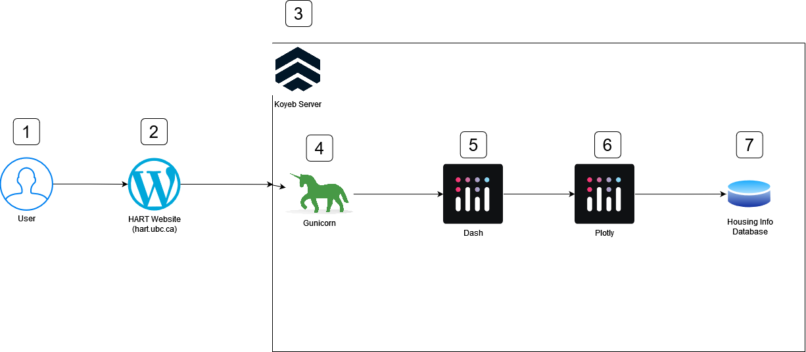

# HART Tool Deep Dive

The first part will be less technical, should be able to interpreted by non-developers.  The second part will hopefully
give a good starting point to any developers hoping to make changes to this repo.

The main site, hart.ubc.ca is hosted separately, while the HART tool itself is hosted on Koyeb, accessed through an 
embed on the ubc page.  The entire stack is written in python, the frontend being generated by the python library Dash, 
by plotly. The backend data analysis logic is also in Python and mostly in Pandas, a python data analysis library.

## Data Flow 

1. The user accesses the page through a device capable of accessing the web, probably a computer.
2. The webpage responds to the request, the UBC HART page is specifically hosted through a third party company using
WordPress, after the main domain (ubc.ca) routes to our subdomain (hart prefix).  The WordPress server delivers all the 
static content, including an embed to the HART tools service, hosted on Koyeb
3. After Koyeb receives the request, it passes it to our specific instance (HART tool uses a medium size instance)
4. Our instance has a Gunicorn server running in front of our Dash app to help handle requests.  Dash is built on Flask,
and is not meant to handle all http calls, Gunicorn helps parse these calls for our app.  (Gunicorn helps Dash work)
5. Dash is the framework in which our page is actually built in (both visual details, and also how it serves information)
6. Plotly is used to generate all the graphs dynamically when required.  The actual math and table organization is done
with various python libraries including pandas and other data manipulation libraries.
7. The data that is used to return results is sourced from Canada census data, gone through processing to be stored as a
SQLite db file.  All data used for any graphs or results are sourced from this database.

# Technical Deep Dive

Table of Contents

| Index                                       | Description                                    |
|---------------------------------------------|------------------------------------------------|
| [Repo Structure](#repo-structure)           | How the webpage itself actually works          |
| [How to change stuff](#how-to-change-stuff) | How to change the stuff I think may be changed |
| [Future Work](#future-work)                 | What needs to be done in the future            |

Changelog:

10-19-2023 - I'm currently on refactoring the codebase for easier implementation of future features, and also easier 
readability.  For context, when I first stated, there were 5 total python files, 4 of which with 1-2k lines each

03-12-2024 - Well oops I planned to write an update for every major change, but this is my handoff now.  The major feature changes
since I picked up this project 6 months ago was that there is projection by bedrooms (unpublished page 3), housing deficit by bedrooms
and transgender/nonbinary minorities in page 2, adding 2016 data to the pages, and also renters and owners (and subsidized 
renters, page 5).

As for the implementation, I refactored all the paragraphs into their on python script to make things easier to find/navigate
I also did a bunch of bugfixes and error log fixes (compare the 2016 deployment on Koyeb's errors) and changed the deployment
to use a dockerfile.  In addition, I did a bunch of things to make the page more efficient (caching, reducing errors, 
only opening 2 instances instead of 5 on the webpage).  

None of these changes exist in the 2016 version of the page, so you can use it as a reference if I messed something up and
you'd like to revert it, or just use the github history (the correct way).

## Repo structure

This project was initially developed with Licker Geo, but has been internally worked on since 2023-10.  I, Jack have handed
this project off as of April 19th, 2024.  

The data is obtained from Canadian censuses, and stored with their own tools.  This data is stored in high dimensional
methods (hundreds of different keys), and must be queried using their tool.  This data is then exported to csv using 
Beyond2020 (refer to Andrew for help), and parsed using the `db_uploader.py` into a sqlite `hart2021.db` file.  This acts 
as our database for all later non geo requests.

The production stack is served through either Dockerfile or Koyeb's Procfile, both are functional as of time of writing.
By running `gunicorn app:server`, you are able to host a local version of the server at port 8000.  This makes gunicorn
host the Flask app (Dash is just a framework on top of Flask).

The way the data flows through the individual python files are:

1. `app.py` is the root of all the pages.  It acts as a router to the specific each page.  `pages/page1.py` is the map,
while `page2.py` to `page5.py` are the data tables.
2. All of these pages are written with a Dash framework.  As such, they are able to share information about the current
selected geography using `dcc.store` variables (can be found in `helpers/table_helper.py`)
3. The table information is all sourced from `create_engine.py` to prevent redundant memory usage.  The file dynamically
imports the data from all years using `pandas` library, and does some simple data cleaning.
4. Each page serves a copy of a static page, with a default region hardcoded, then on page load, Dash performs an initial
call onto each callback function, which then processes the actual selected region from `page1.py`

   
## How to change stuff

### How to change paragraph texts
This is the easiest thing.  All the paragraphs are stored in `helpers/paragraph_files.py`.  You can change the text, and
any links are automatically added by the functions at the end of the page.  Feel free to change these as you'd like.  
If you don't know what the `re_links` means, this is called "Regex", and is a fancy way to match texts.  You can use these 
pages to help you learn how they work better.  https://www.dataquest.io/blog/regex-cheatsheet/ https://regex101.com/.

### How to change the data
Well this is a pain.  It depends on what data you wanna change.  If it's anything from page 1-4, other than the bedroom 
things and nonbinary things, either you'll want to regenerate data using the [HNA-DataGen](https://github.com/UBC-HART/HNA-DataGen).
Any other data would be generated from `/data_analysis/` directory.  I suggest writing a new script to append/modify existing 
data, because otherwise you'll need to completely understand how me and LGeo did things (which I guess you should learn anyways).

### How to change 
## Future Work
As of 3/12/2024, there were three further features planned

1. Changing the layout of the buttons on the HART page to choose which page to go to.  This is purely an HTML/CSS/JS change
on the HART page.  You can also use wordpress but I don't know how to do that.  Ask Sam for access to Wordpress.
2. Adding French to this tool.  This is a huge pain in the ass.  Most services would use a translation layer, but since
we have graphs, this is not viable.  As such, you will need to add a English/French phrase for text that appears, and additionally
do French versions of numbers and such.  The English>French can be done and is half done already by using a dict for each phrase, 
referencing a global language variable saved in our `dcc.Store`.  This is found in `helpers/localization.py`, current language
is found in `helpers/table_helper.py`, through a function `get_language`.  This function takes in the URL of the page, and 
parses the language stored in the url.  

Not all the phrases are implemented as French became low priority (plus I hate working on it).  You'll need to replace
a lot of strings using the dict system I implemented in some of the pages.  In addition, all the paragraphs are in `helpers/paragraph_files.py`
so it'll be easy to find.
3. Adding 2026 data is the final goal.  If you're working on this it's gonna be 2027, hopefully this stuff isn't too outdated.
This should be relatively straightforward.  You'll need to generate the data using [these files](https://github.com/UBC-HART/HNA-DataGen)
and then add to them using `data_analysis.py`.  Then place the files in `sources/previous_years` and change `year_data.py`.
Then, you'll have to change `toggle_year_comparison` in `pages/page1`.  You can change button layouts, so you can select 
2026 vs 2016 or 2026 vs 2021 and the implementation in theory would work with how I implemented things.  
Hopefully, it'll work straight-up like that, but realistically things break.

You'll most likely have to change a lot of label names as stats can is horribly inconsistent.  In addition, you may need to
redo the maps to use 2026 data, and that's something I never did so good luck.  Try to keep to using the geocodes, as city
names change (plus using names instead of codes is dumb shit anyway for consistency, looking at you LGeo).  

